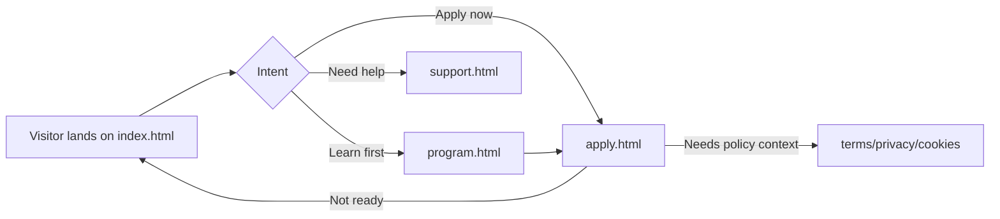
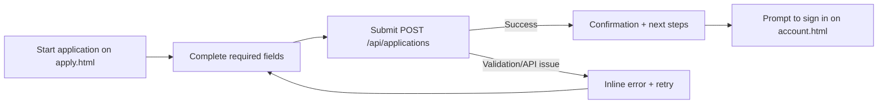
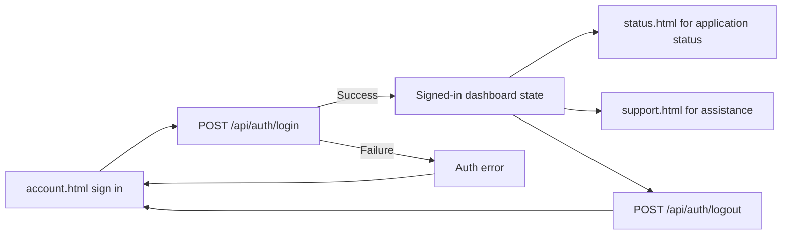
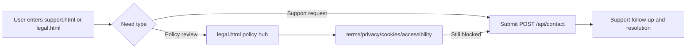

# Portal Flow Map

## Full sitemap

| Page | Purpose | Primary CTA in | Primary CTA out | Owner / Status |
| --- | --- | --- | --- | --- |
| `index.html` | Public landing page with program overview and route selection. | Direct visit, search, external referrals. | **Apply now** → `apply.html`; **Sign in** → `account.html`; **Program details** → `program.html`; **Support** → `support.html`. | Product / Active |
| `program.html` | Explains grant scope, eligibility, and process details. | `index.html` program details CTA. | **Start application** → `apply.html`; **Back to home** → `index.html`. | Program Ops / Active |
| `apply.html` | Primary applicant intake form and submission flow. | `index.html` or `program.html` apply CTA. | **Submit application** (API); confirmation + next-step guidance to `account.html`; legal links to `terms.html`, `privacy.html`, `cookies.html`. | Applications Team / Active |
| `account.html` | Signed-in user account entry, authentication, and dashboard state. | Sign-in CTA, post-apply handoff, forgot-password route. | **Sign in / Continue** to user state; **Forgot password** → `forgot-password.html`; **Support** → `support.html`; **Status** → `status.html`. | Auth + Portal Eng / Active |
| `forgot-password.html` | Password reset initiation page for returning users. | `account.html` forgot password CTA. | **Send reset link** then return path to `account.html`. | Auth + Portal Eng / Active |
| `status.html` | Application status lookup/summary page. | Authenticated account route or direct bookmarked access. | **View account** → `account.html`; **Need help** → `support.html`. | Case Management / Active |
| `support.html` | Public and signed-in support intake and contact paths. | Global nav/footer links and error/fallback states. | **Submit support request** (API); **Legal resources** → `legal.html`; **Back home** → `index.html`. | Support Operations / Active |
| `legal.html` | Legal policy hub for all policy documents. | Footer legal links from all pages. | Links to `terms.html`, `privacy.html`, `cookies.html`, `accessibility.html`; return route to `index.html`. | Legal / Active |
| `terms.html` | Terms and conditions reference. | `legal.html` and form disclosure links. | Return route to `legal.html` or `apply.html`. | Legal / Active |
| `privacy.html` | Privacy notice and data-use disclosure. | `legal.html` and form disclosure links. | Return route to `legal.html` or `apply.html`. | Legal / Active |
| `cookies.html` | Cookie usage policy and preferences context. | `legal.html`, cookie/footer references. | Return route to `legal.html` or `index.html`. | Legal / Active |
| `accessibility.html` | Accessibility statement and accommodation guidance. | `legal.html` accessibility link. | **Request accommodation** → `support.html`; return route to `legal.html`. | Accessibility + Legal / Active |
| `404.html` | Not found/error recovery for invalid routes. | Invalid URL or stale deep link. | **Go to home** → `index.html`; **Get support** → `support.html`. | Platform / Active |

## End-to-end journey diagrams

### 1) Visitor journey

### 2) Applicant journey

### 3) Signed-in user journey

### 4) Support / Legal journey

